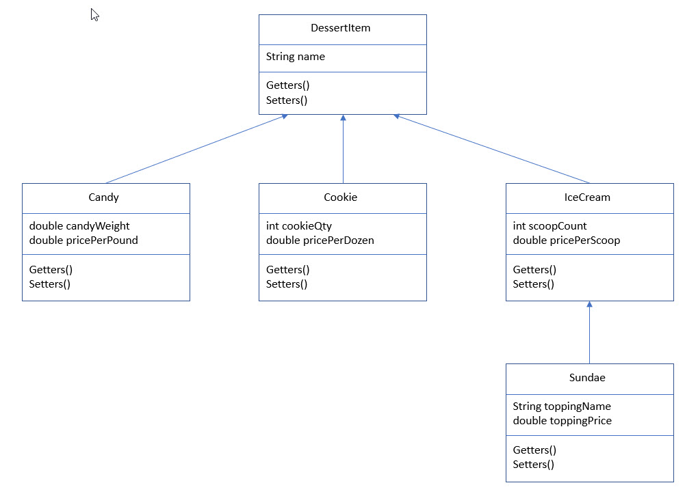

Lab 3a: Dessert Shop Part 1: Class Structure
============================================

**Follow the CS 115 Formatting Guide, which is found in the CS 115 Course Information module.**

Getting credit for this assignment requires two steps:

1.  Submit your finished code by clicking **Start Assignment** at the top of the page. Then upload your assignment using the **Choose File** option at the bottom of the page and click **Submit Assignment**. Include any comments you may wish the teacher to see when grading your assignment.  
2.  You **MUST pass off** the lab with the TA or tutor during their office hours (their information is in the "CS 115 Course Information" section of the Class Resources module) or with the teacher in class.

**Read the instructions carefully.**Not following the instructions will result in not getting credit for the assignment.\
**Make sure your output matches the Example Run.**

Objectives:
===========

In this lab, you will learn how to do the following:

-   Build a Java superclass.
-   Build several Java subclasses.
-   Overload methods with multiple signatures.
-   Build a project with three levels in the Inheritance Hierarchy.
-   Create JUnit test cases for constructors, get methods, set methods, and other methods.

Structure:
==========

Create the following structure in Eclipse for this lab.

-   **Package Name: DessertShop**
-   **Class Names:**
    -   **DessertItem**
    -   **Candy**
    -   **Cookie**
    -   **IceCream**
    -   **Sundae**

Program: Dessert Shop, Part 1---Class Structure
=============================================

A Dessert Shop sells candy by the pound, cookies by the dozen, ice cream by the scoop, and sundaes (ice cream with a topping).

In this lab, you will create the **structure** for a Dessert Shop program. There will be no user interface or input/output in conjunction with this lab. The lab will be tested using JUnit test cases.

To do this, you will implement an inheritance hierarchy of classes derived from a DessertItem superclass. Candy, Cookie, and IceCream classes will derive from the DessertItem class. The Sundae class will derive from the IceCream class. The classes will be structured as follows:

### The DessertItem superclass contains:

-   A single attribute, name
    -   The name attribute MUST be private. You may not use the 'protected' access modifier.
-   Two constructors:
    -   A default that takes no arguments and sets the name instance variable to a default 0-type value.
    -   One that has one argument and sets the name instance variable to the passed-in argument.
-   An appropriate get()-type method and a set()-type method for the name attribute.
    -   The getter()-type method takes no arguments and returns the appropriate instance variable.
    -   The setter()-type method takes an appropriate argument and sets the appropriate instance variable. The setter() -type methods will not return any values.

### All derived subclasses (Candy, Cookie, IceCream, and Sundae) contain:

Attributes as described below
-   Two constructors:
    -   A default that takes no arguments, calls the default constructor of the superclass, and sets all instance variables local to the class to default 0-type values.
    -   One that has enough arguments to populate ALL instance variables (both local and those from the superclass), calls the all-argument constructor of the superclass and sets all instance variables local to the class to the passed-in arguments of the constructor.
-   Appropriate get()-type methods and a set()-type methods for each instance variable local to the class.
    -   Each getter()-type method takes no arguments and returns the appropriate instance variable.
    -   The setter()-type method takes an appropriate argument and sets the appropriate instance variable. The setter() -type methods will not return any values.

### The Candy Class:

-   Contains only two attributes:
    -   double candyWeight
    -   double pricePerPound

### The Cookie Class:

-   Contains only two attributes:
    -   int cookieQty
    -   double pricePerDozen

### The IceCream Class:

-   Contains only two attributes:
    -   int scoopCount
    -   double pricePerScoop

### The Sundae Class:

-   Contains only two attributes:
    -   String toppingName
    -   double toppingPriceUML Diagram:
        ============

UML Diagram:
============

# Create JUnit test cases for each method fo    r each class.

-   The DessertItem class will have two test cases.
-   All other classes will have four test cases.

**Keep each test case simple, as described below!**

### getter()-type methods:

Test cases for all get()-type methods will

-   invoke the all-attribute constructor,
-   call the appropriate get() method, and
-   compare the value returned from the get() method with the value passed into the constructor,

### setter()-type methods:

Test cases for all set()-type methods will

-   invoke the all-attribute constructor;
-   call the appropriate set() method, changing the value passed in through the constructor; and
-   compare the value passed to the set() method with the value returned from the getter() method to ensure the value change from the original constructor invocation.
    Key Program Requirements:
    All classes and methods are created as described above.

All JUnit test cases are created as described above.

All JUnit test cases pass.

## Submission
Turn in TEN (10) .java files:

DessertItem.java
DessertItemTest.java
Candy.java
CandyTest.java
Cookie.java
CookieTest.java
IceCream.java
IceCreamTest.java
Sundae.java
SundaeTest.java

Example Run:
There is no sample run for this lab. Verification for this lab will be the results of the five (5) JUnit test classes created.